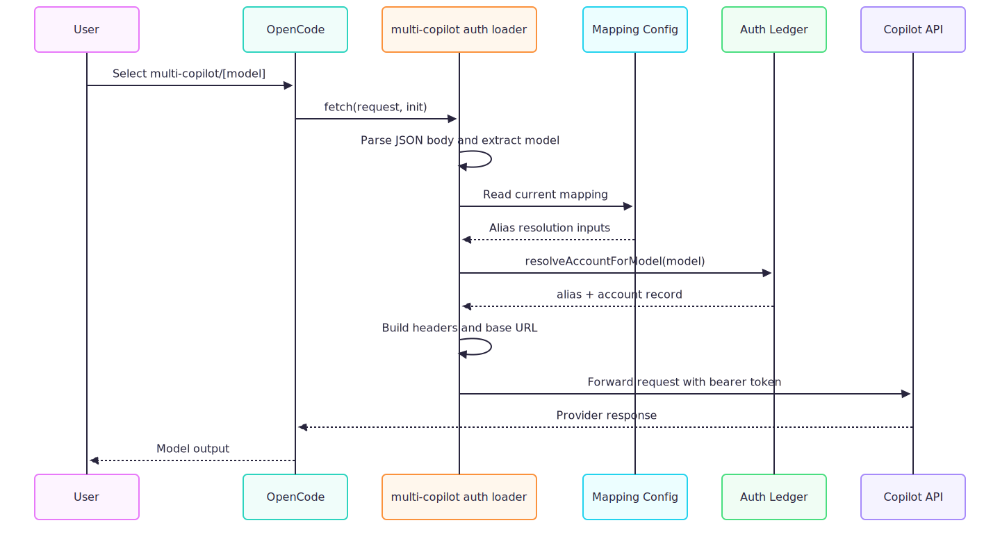

# Architecture

## Component overview

The plugin is split across five runtime modules plus one schema module.

| Module | Responsibilities | Key exported behaviour |
| --- | --- | --- |
| `src/index.ts` | Bootstraps the plugin and registers provider metadata | Default export `MultiCopilotPlugin(input)` |
| `src/auth.ts` | Defines the auth hook, wrapped fetch, model mirroring, and device flow | `createAuthHook(input)` |
| `src/config.ts` | Creates config files, reads mappings, and caches mapping state | `ensureMappingConfig()`, `readMappingConfig()` |
| `src/ledger.ts` | Loads and stores alias records with per-alias write serialisation | `getTokenForAlias()`, `resolveAccountForModel()` |
| `src/provider.ts` | Resolves API base URLs and inspects request payloads | `constructBaseURL()`, `detectVision()`, `detectAgent()` |
| `src/schemas.ts` | Enforces runtime schemas for user-controlled JSON data | `MappingConfigSchema`, `AuthLedgerSchema` |

## Startup flow

On plugin initialisation, `MultiCopilotPlugin` performs two bootstrap actions before returning hooks:

1. `ensureMappingConfig()` makes sure the routing file exists.
2. `ensureAuthLedger()` makes sure the auth ledger exists and applies `0600` permissions where supported.

After that, the plugin returns:

- A `config` hook that registers the `multi-copilot` provider
- An `auth` hook created by `createAuthHook(input)`

## Request execution flow

At runtime, request handling follows this sequence:

1. OpenCode dispatches a request through `multi-copilot/[model]`.
2. The auth loader returns a wrapped `fetch` implementation.
3. The wrapper extracts the requested model from the JSON body.
4. The ledger resolves the target alias from the current mapping file and stored accounts.
5. The wrapper builds headers and rewrites the request host if the account uses GitHub Enterprise.
6. The request is forwarded to the Copilot API.

## Model exposure strategy

The plugin can expose models in two ways:

| Strategy | Trigger | Result |
| --- | --- | --- |
| Static mapping exposure | `config` hook with existing mapping entries | Exposes only mapped model IDs under `multi-copilot` |
| Dynamic mirroring | `model_mirroring: "auto"` | Fetches the native `github-copilot` provider catalogue and mirrors discovered models |

Dynamic mirroring strips provider-specific fields from the source model definitions and rewrites the provider metadata so requests continue to flow through the custom fetch wrapper.

## State management

The architecture uses two persistent state files and one optional cache file.

| State file | Owner module | Access pattern |
| --- | --- | --- |
| `multi-copilot-mapping.json` | `src/config.ts` | Read with modification-time caching |
| `multi-copilot-auth.json` | `src/ledger.ts` | Read once, cached in memory, updated atomically |
| `multi-copilot-models-cache.json` | `src/config.ts` | Best-effort write during mirroring |

## Concurrency model

`src/ledger.ts` prevents overlapping writes for the same alias by using an in-memory promise queue per alias. Different aliases can still be written concurrently.

## Error strategy

- Missing mapping file or auth ledger at startup is handled by creating a default file.
- Invalid mapping JSON or schema violations throw explicit errors from `readMappingConfig()`.
- Missing authenticated aliases throw explicit guidance to run `opencode auth multi-copilot`.
- Non-recoverable OAuth polling failures return `{ type: "failed" }` to OpenCode.

## Visual references

